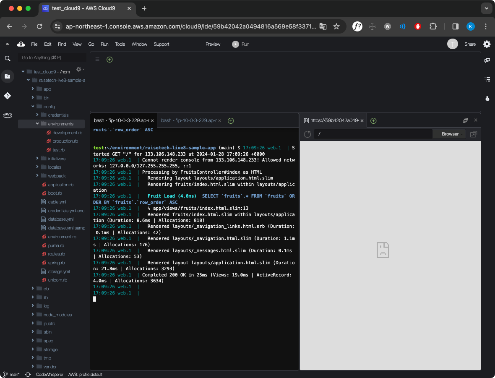
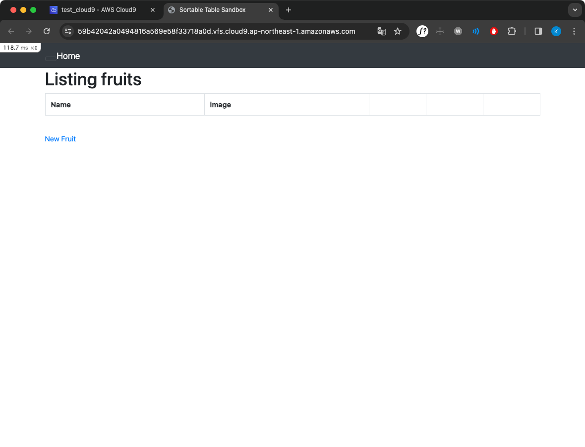
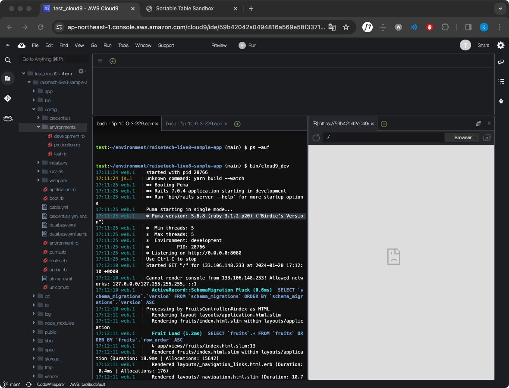
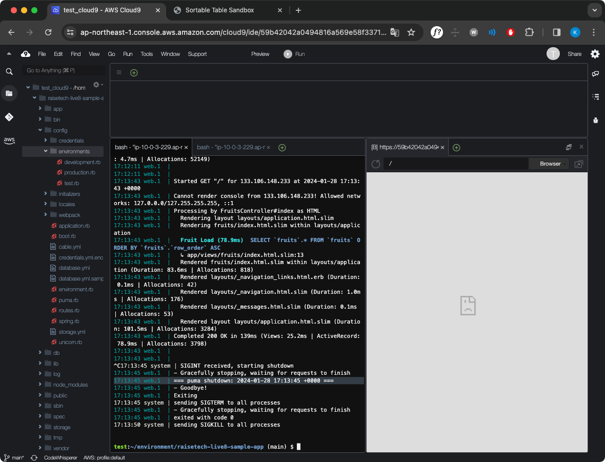
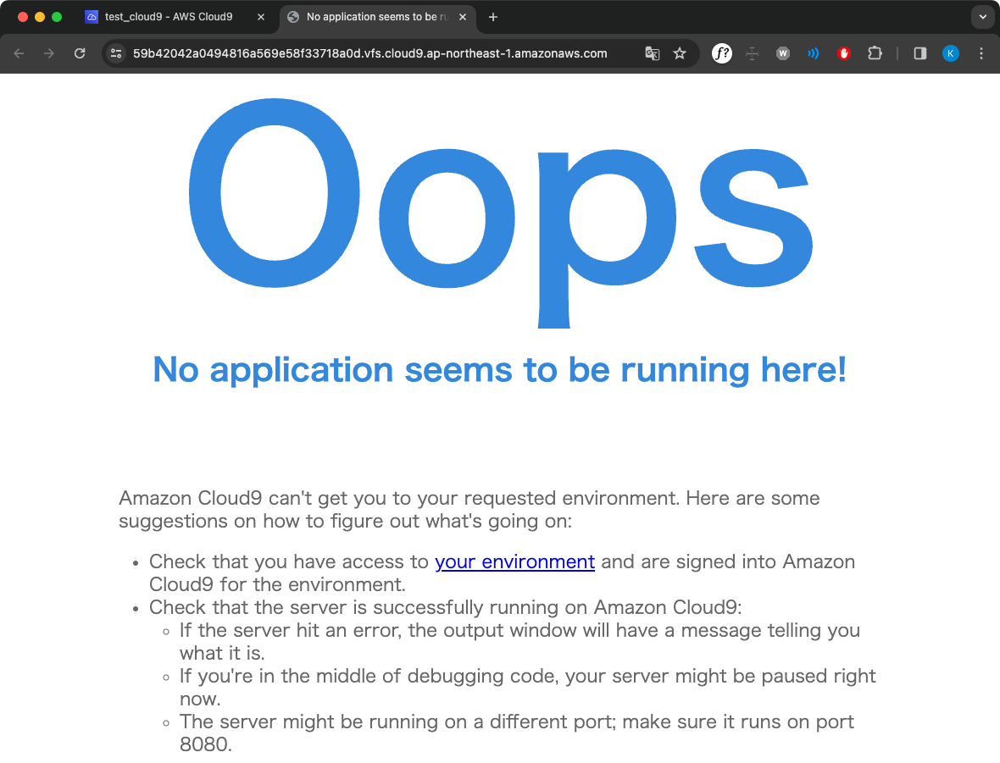
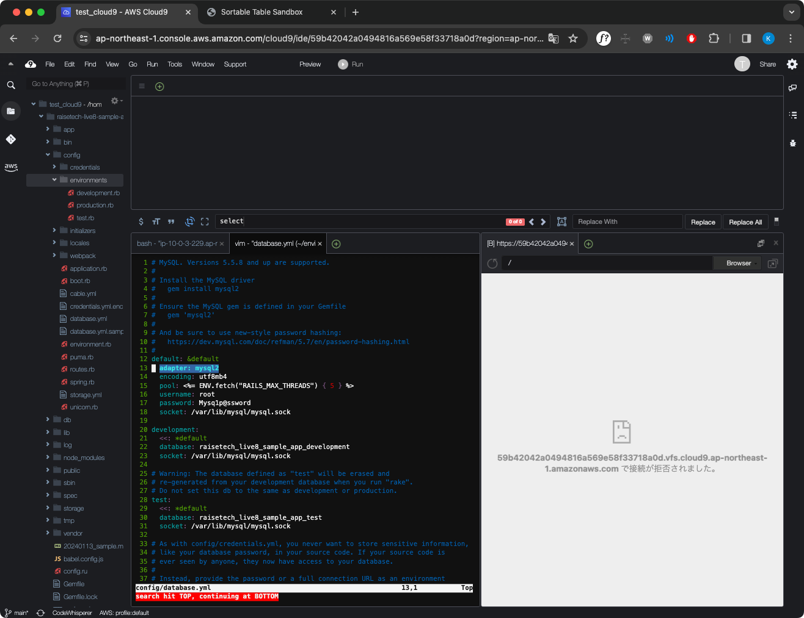
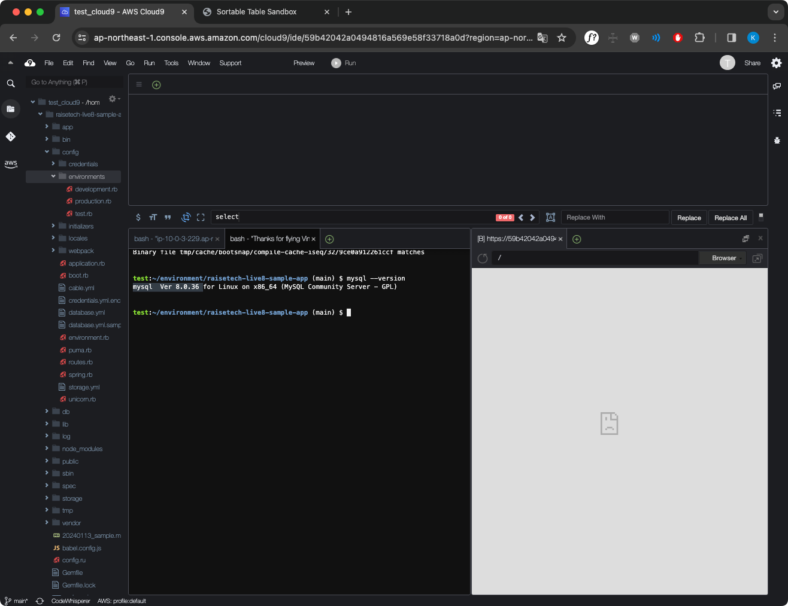
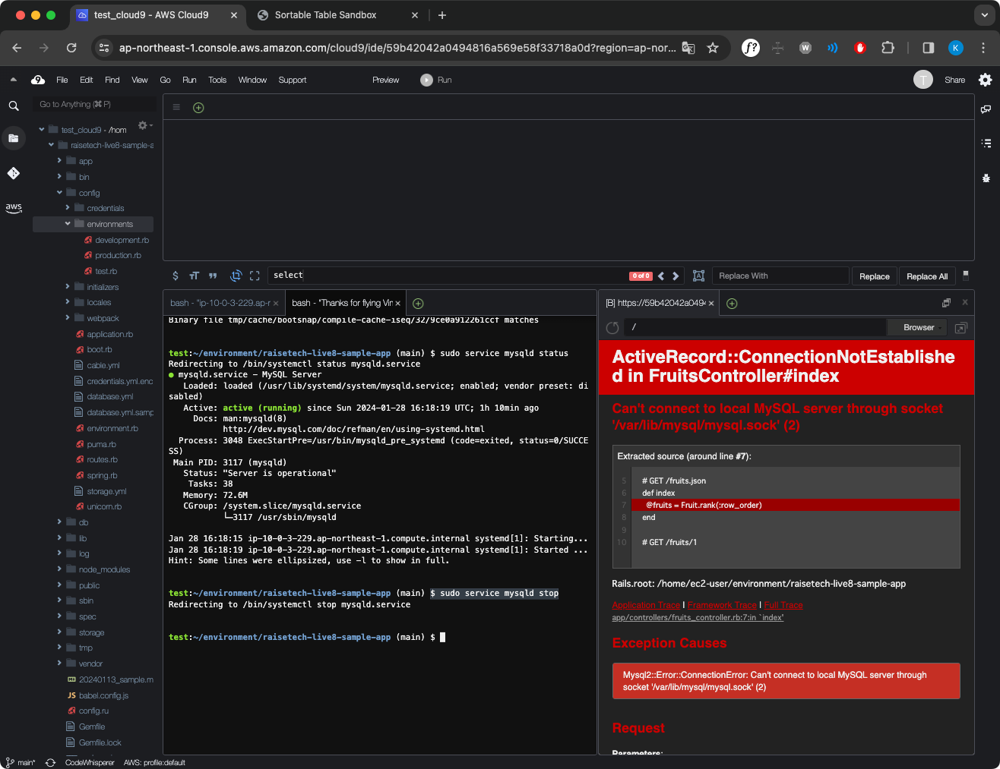
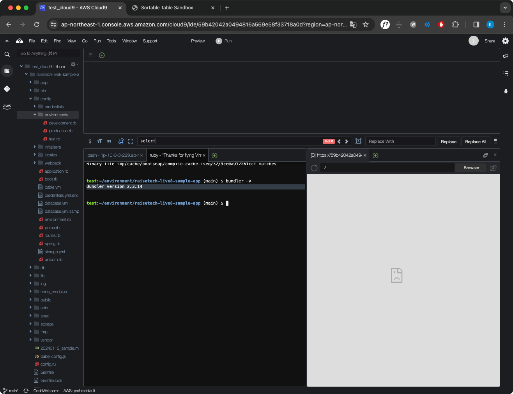

## 課題
1. サンプルアプリケーションを起動（デプロイ）する
    [サイトURL](https://59b42042a0494816a569e58f33718a0d.vfs.cloud9.ap-northeast-1.amazonaws.com/) ※ Google Chromeブラウザで開くこと
    
    
1. APサーバーについて調べる
    1. APサーバーの名前とバージョンの確認
        
    1. APサーバーを終了させた場合に引き続きサイトにアクセスできるか確認
        
        
1. DBサーバーについて調べる
    1. DBサーバー（DBエンジン）の名前の確認
        
    1. DBサーバーのバージョンの確認
        
    1. DBサーバーを終了させた場合に引き続きサイトにアクセスできるか確認
        
1. Railsの構成管理ツールの名前とバージョンの確認
    

---

## 学んだこと
- WebサイトとWebアプリケーションの区分けについて学べた
    - リクエストに対してサーバー側で動的な処理を行うのがWebアプリケーション
    - 何度アクセスしても同じ情報を表示するサイトがWebサイト
- Ruby on RailsによるWebアプリケーションの起動方法の流れを学べた
- mysqlのサービスの状態を確認するときになぜ<code>$ service mysqld status</code>なのか
    - mysqldのdはデーモン（常駐プログラム）を意味している

## 感想
- RailsによるWebアプリの作成は、各ツールやライブラリのバージョンが噛み合わないと動作しない（互換性がない）点でシビアに感じた

