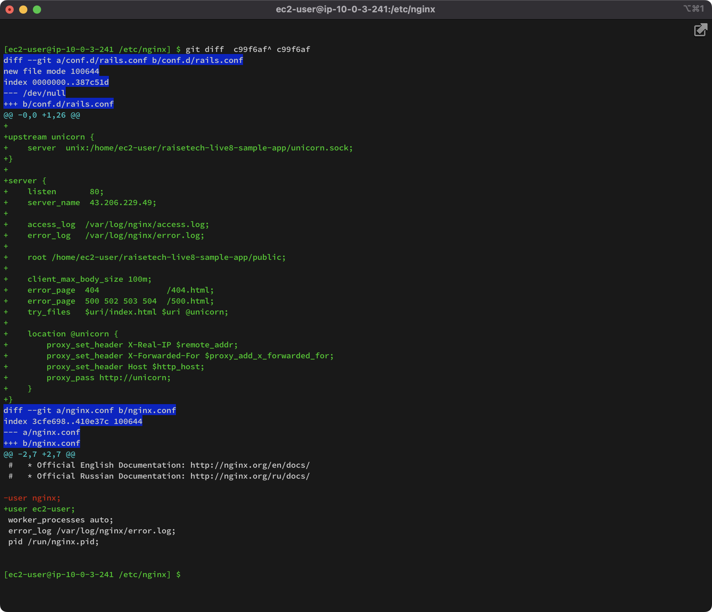

## 課題
1. 組み込みサーバーでデプロイ
    起動プロセスの確認
    
    RDS接続設定
    
    ブラウザでアプリページアクセス確認
    
1. Webサーバー(Nginx)とAPサーバー(Unicorn)でデプロイ
    Nginxの設定
    
    Nginxの起動
    
    Unicornの起動
    
    ブラウザでアプリページアクセス確認
    
1. ELB(ALB)の追加
1. S3の追加
1. 構成図

---

## 学んだこと
-

## 感想
-

