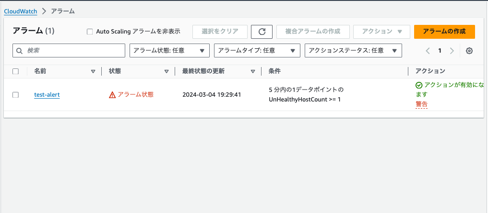

## 課題
1. CloudTrail（証跡）のイベント確認<br>
    インスタンス停止のイベント履歴確認
    

    イベントレコード抜粋
    | フィールド名                       | 説明                            |
    |:-----------------------------------|:--------------------------------|
    | "userIdentify":{...}               | 操作を行なったAWSアカウント情報 |
    | "eventTime":"2024-02-25T15:47:39Z" | 実行日時                        |
    | "eventSource":"ec2.amazonaws.com"  | 対象サービス名                  |
    | "eventName":"StopInstances"        | 対象サービスで行なった操作      |

    
1. CloudWatch（監視・通知）アラームを使ったALBのアラーム設定<br>
    第5回課題の環境でUnicornを起動しない状態にしてターゲットグループのEC2をUnhealthyにする
    
    CloudWatchアラームの作成
    
    OKアクションとアラームアクションの設定
    <br>
    受信メールからサブスクリプションの承認をする
    
    Unicornを起動しターゲットグループのEC2をHealthyにする<br>
    `$ bundle exec unicorn -c config/unicorn.rb -D`
    
    CloudWatchアラームのOKアクションが動作しメールが届く
    
    Unicornを停止しターゲットグループのEC2をUnhealthyにする
    ``` bash
    $ ps -ef | grep unico
    ec2-user 15984 15631  0 13:02 pts/5    00:00:00 vim -p config/unicorn.rb
    ec2-user 22500     1  0 14:24 ?        00:00:00 unicorn master -c config/unicorn.rb -D
    ec2-user 22507 22500  0 14:24 ?        00:00:00 unicorn worker[0] -c config/unicorn.rb -D
    ec2-user 22508 22500  0 14:24 ?        00:00:04 unicorn worker[1] -c config/unicorn.rb -D
    ec2-user 22509 22500  0 14:24 ?        00:00:01 unicorn worker[2] -c config/unicorn.rb -D
    ec2-user 24168 16030  0 15:07 pts/6    00:00:00 grep --color=auto unico

    $ kill -9 15984
    ```
    
    CloudWatchアラームのアラームアクションが動作しメールが届く
    
1. AWS利用料の見積もり作成<br>
    https://calculator.aws/#/estimate?id=b2e41165e864525c0b959ab593876d93732d1b16
1. AWSの請求とコスト管理から現在の利用料を確認<br>
    


---

## 学んだこと
- ターゲットグループに登録したEC2がUnhealthyになる条件を学んだ
- インフラはシステムを作ってからがスタート システムが安定して稼働し続けることが重要
- メトリクスとは監視に使うデータのこと EC2の場合はCPU使用率、CPUアイドル時間率、メモリ使用率など

## 感想
- AWSの証跡・ロギング・監視・通知などインフラ安定稼動に関する機能が知れて面白かった。
- 利用料の見積もり作成の課題を通じて、改めてコスト管理を意識していこうと思った。


