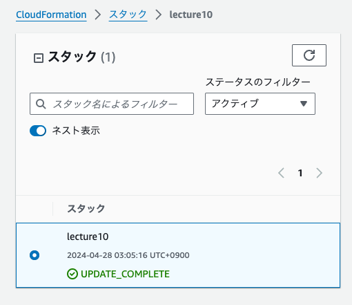
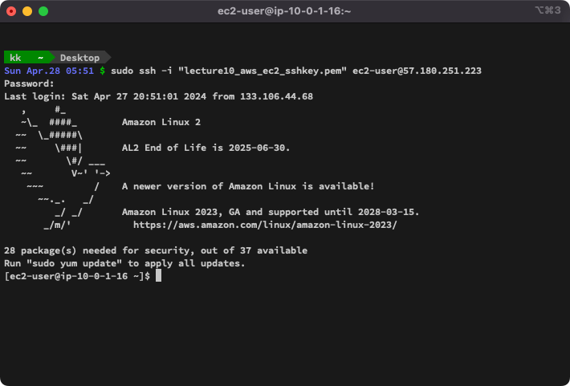
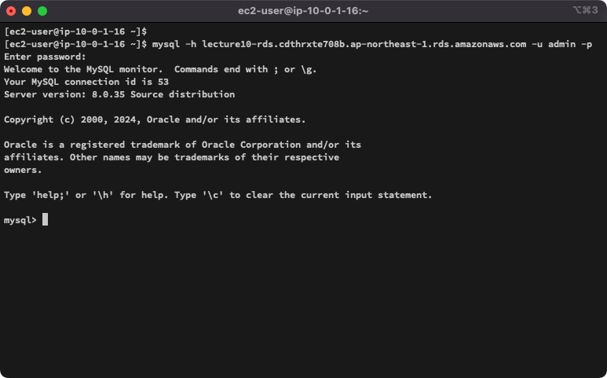

## 課題
1. 第5回でAWSマネジメントコンソールを使って構築した環境をCloudFormationで構築する 
    テンプレートファイル [lecture10.yaml](./lecture10.yaml) を作成しスタックを作成 
    構築したもの
    - VPC
    - サブネット
    - インターネットゲートウェイ
    - VPCGatewayAttachment
    - ルートテーブル
    - サブネットとルートテーブルの関連付け
    - インターネットゲートウェイとルートテーブルの関連付け
    - セキュリティグループ
    - EC2インスタンス
    - RDS
    - RDSのサブネットグループ
    - ELB（ALB）のターゲットグループ
    - ELB（ALB）
    - ELB（ALB）のHTTPリスナー
    - S3バケット

    CloudFormationの結果 
     
    EC2へSSH接続確認 
     
    EC2からRDSへ接続確認 
     

---

## 学んだこと
- CloudFormationの書き方と使い方

## 感想
- 今まで作ったAWSリソースをテンプレートファイルに書き出すのは大変だったが、1度作ってしまえば今後使いまわせるし、素早く同じ環境を構築でき便利だと思った。

