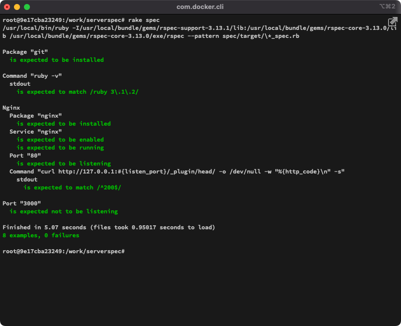

## 課題

### 準備

1. EC2インスタンス上にGit, Ruby, Nginxをインストール
1. Nginxを起動
1. Serverspecを実行する環境を構築（ローカルPC上のDockerを使用）

    ツリー情報

    ``` console
    $ tree
    .
    ├── Dockerfile
    └── work
        ├── lecture10_aws_ec2_sshkey.pem
        └── serverspec
            ├── Rakefile
            └── spec
                ├── spec_helper.rb
                └── target
                    └── lecture11_spec.rb

    4 directories, 5 files
    ```

    使用したDockerfile

    ``` console
    $ cat Dockerfile
    FROM ruby:3.1.2

    RUN apt-get update -qq && apt-get install -y build-essential libpq-dev nodejs default-mysql-client vim

    CMD ["/bin/bash"]
    ```

    コンテナの作成と起動

    ``` console
    $ docker build -t serverspec .
    $ docker run --rm --name serverspec_test --privileged -it -v $(pwd)/work:/work serverspec
    ```

    コンテナ上でServerspecのインストールと初期化

    ``` console
    root@524b24a1bf18:/# gem install serverspec
    root@524b24a1bf18:/# mkdir serverspec
    root@524b24a1bf18:/# cd serverspec/
    root@9e17cba23249:/work# serverspec-init
    Select OS type:

      1) UN*X
      2) Windows

    Select number: 1

    Select a backend type:

      1) SSH
      2) Exec (local)

    Select number: 1

    Vagrant instance y/n: n
    Input target host name: target
     + spec/
     + spec/target/
     + spec/target/sample_spec.rb
     + spec/spec_helper.rb
     + Rakefile
     + .rspec
    ```

    SSH接続設定ファイルの作成

    ``` console
    root@9e17cba23249:~# cat ~/.ssh/config
    Host target
        HostName 18.177.137.56 # EC2インスタンスのIPアドレス
        User ec2-user
        IdentityFile /work/lecture10_aws_ec2_sshkey.pem
    ```

### Serverspecによるテストの実行

テストコード [lecture11_spec.rb](./lecture11_spec.rb) の作成  ※ sample_spec.rbファイルは削除

``` ruby
require 'spec_helper'

# gitがインストールされているかの確認
describe package('git') do
  it { should be_installed }
end

# バージョン3.1.2のRubyがインストールされているかの確認
describe command('ruby -v') do
  let(:disable_sudo) { true }
  its(:stdout) { should match /ruby 3\.1\.2/ }
end

describe 'Nginx' do
  listen_port = 80

  # Nginxがインストールされているかの確認
  describe package('nginx') do
    it { should be_installed }
  end

  # Nginxが有効かつ実行中かの確認
  describe service('nginx') do
    it { should be_enabled }
    it { should be_running }
  end

  # 80番ポートがリクエストを受け付けているかの確認
  describe port(listen_port) do
    it { should be_listening }
  end

  # HTTPステータスコードが200であることの確認
  describe command('curl http://127.0.0.1:#{listen_port}/_plugin/head/ -o /dev/null -w "%{http_code}\n" -s') do
    its(:stdout) { should match /^200$/ }
  end
end

# 3000番ポートがリクエストを受け付けていないことの確認
describe port(3000) do
  it { should_not be_listening }
end
```

テストの実行

``` console
root@9e17cba23249:/work/serverspec# rake spec
```

実行結果



---

## 学んだこと

- ServerspecとはRubyで作られたインフラの自動テストを行うツール
- Serverspecは外部から実行しテスト自体はテスト対象のサーバー上で実行される
- テスト対象のサーバー上にはRubyの実行環境が必要

## 感想

- 様々なテストが簡単に実行できて面白かった。

