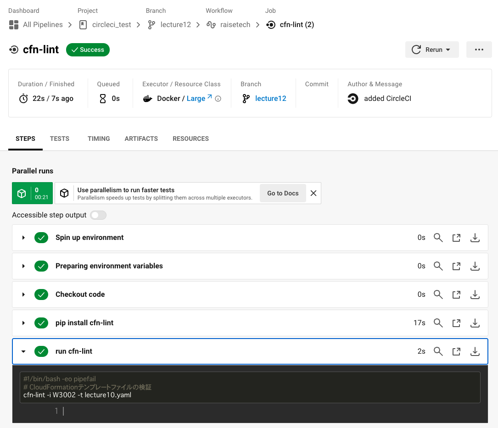

## 課題

### 手順

1. CircleCIのアカウント作成
1. CircleCI上でプロジェクトを作成し、対象のGitHubリポジトリを登録
1. [config.yml](.circleci/config.yml) の作成
1. GitHubへPush

### 実行結果

---

## 学んだこと

- CircleCIの使い方

## 感想

- CircleCIはJenkinsに比べてサーバーの管理が不要な点で便利だと感じた。

