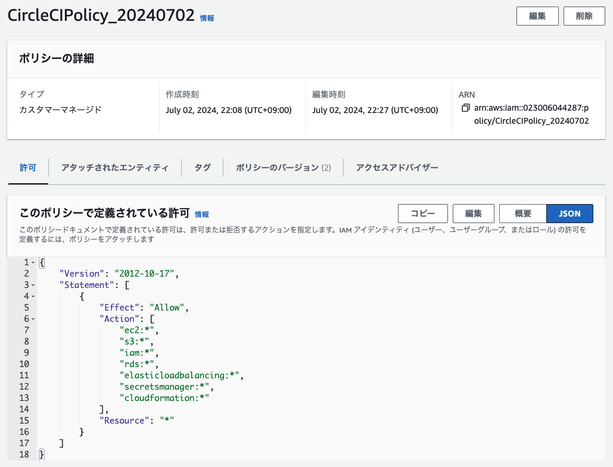
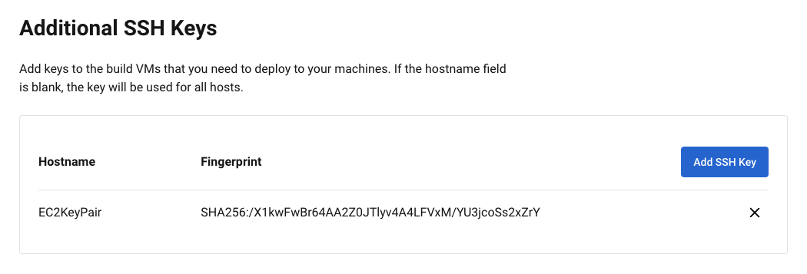
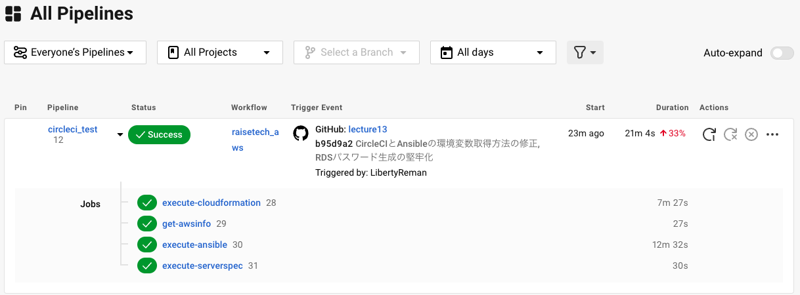
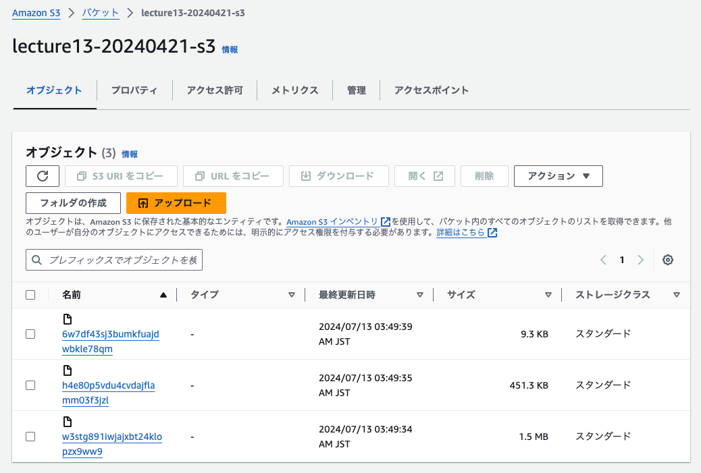

## 課題

### 準備

#### CircleCIでCloudFormationを実行する準備

- CircleCI用のIAMユーザーとIAMポリシーを作成

- CircleCI用のIAMユーザーのアクセスキーを作成
- 作成したアクセスキーとリージョン情報をCircleCIの環境変数に設定
  - AWS_DEFAULT_REGION
  - AWS_ACCESS_KEY_ID
  - AWS_SECRET_ACCESS_KEY
  

#### CircleCIでAnsibleを実行する準備

- EC2にSSH接続するために事前に作成したEC2のキーペアをCircleCIのSSH Keysに設定

- CircleCIでAWS CLIを実行しCloudFormationで作成したEC2のパブリックIPアドレス、RDS認証情報、S3バケット名を取得

#### CircleCIでServerspecを実行する準備

- EC2にSSH接続するためにCircleCI コンテナ内の~/.ssh/configファイルを編集

### 実行結果

- CircleCIの実行結果

- ELBのDNS名でサンプルアプリページへのアクセス確認

- S3画像保存の確認

---

## 学んだこと

- CircleCIでCloudFormation、Ansible、Serverspecを実行する方法

## 感想

- インフラ構築、デプロイ、テストを一貫して自動化する仕組みを作ることができて嬉しかった。
- AnsibleでRailsサンプルアプリをデプロイするのが難しかった。

