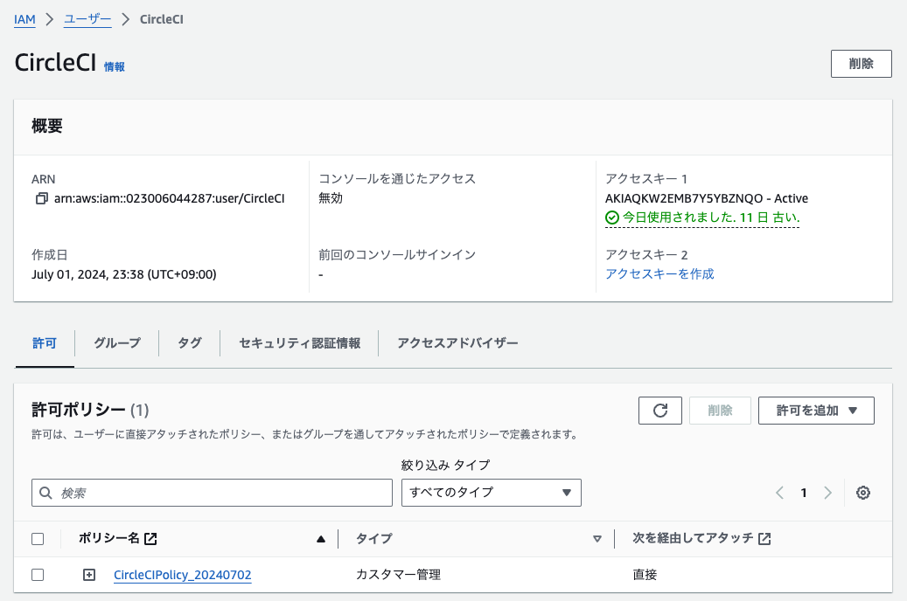

## 課題

### 準備

#### CircleCIでCloudFormationを実行する準備

1. CircleCI用のIAMプロファイルとIAMユーザーを作成
    
1. CircleCI用のIAMユーザーのアクセスキーを作成
1. アクセスキーとリージョン情報をCircleCIの環境変数に設定
    - AWS_DEFAULT_REGION
    - AWS_ACCESS_KEY_ID
    - AWS_SECRET_ACCESS_KEY
    

#### CircleCIでAnsibleを実行する準備

1. EC2にSSH接続するために事前に作成したEC2のキーペアをCircleCIの環境変数に設定
    
1. CircleCIでAWS CLIを実行しCloudFormationで作成したEC2のパブリックIPアドレス、RDS認証情報、S3バケット名を取得

#### CircleCIでServerspecを実行する準備

1. EC2にSSH接続するためにCircleCI コンテナ内の~/.ssh/configファイルを編集

### 実行結果

---

## 学んだこと

- CircleCIでCloudFormation、Ansible、Serverspecを実行する方法

## 感想

- AnsibleでRailsサンプルアプリをデプロイするのが難しかった。

